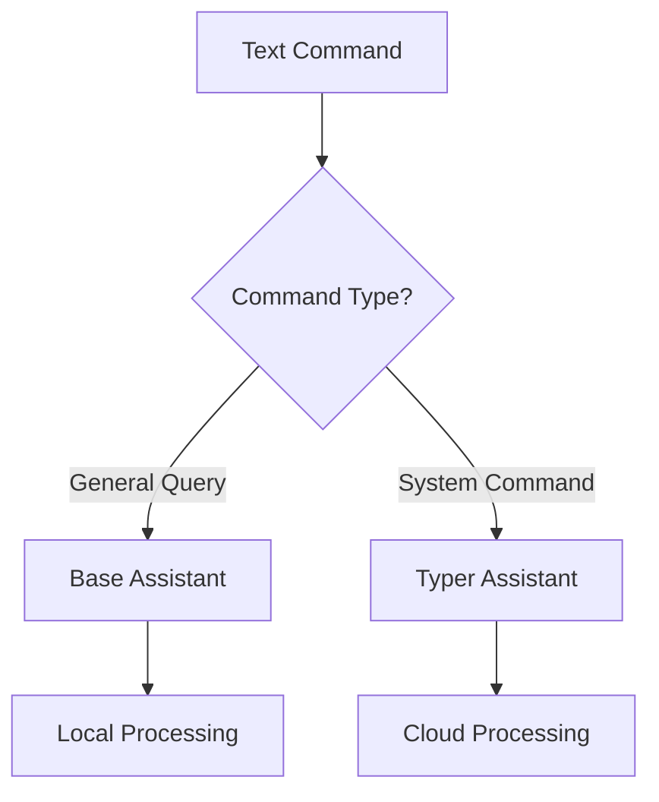

# AI System Documentation

## AI Architecture Overview

The Always-On AI Assistant implements a sophisticated dual-agent architecture, combining two specialized AI models for optimal performance and capability distribution.

### System Architecture Diagram
```
┌──────────────────────────────────────────────────────────────────┐
│                      AI System Architecture                      │
├──────────────────────────────────────────────────────────────────┤
│                                                                  │
│ ┌────────────────────────┐          ┌────────────────────────┐  │
│ │    Base Assistant      │          │    Typer Assistant     │  │
│ │    (Local Model)       │          │    (Cloud Model)       │  │
│ │                        │          │                        │  │
│ │  • Model: phi4         │          │  • Model: Deepseek V3  │  │
│ │  • Purpose: Chat      ◄──────────►│  • Purpose: Commands   │  │
│ │  • Memory: Stateless   │          │  • Memory: Stateful    │  │
│ └────────────────────────┘          └────────────────────────┘  │
│                                                                  │
└──────────────────────────────────────────────────────────────────┘
```

## AI Components

### 1. Base Assistant (Local Processing)

#### Technical Specifications
- **Model**: phi4 via ollama
- **Type**: Local execution
- **Architecture**: Transformer-based language model
- **Purpose**: General conversation and basic query handling

#### Key Features
- Lightweight processing
- No external API dependencies
- Minimal latency
- Stateless operation

#### Implementation Details
```python
# Key configuration in assistant_config.yml
base_assistant:
  model: "ollama:phi4"
  prompt_template: None
  memory_type: None
  stt: "RealtimeSTT"
  tts: "local"
```

### 2. Typer Assistant (Cloud Processing)

#### Technical Specifications
- **Model**: Deepseek V3
- **Type**: Cloud API integration
- **Architecture**: Advanced language model with command understanding
- **Purpose**: Complex command processing and execution

#### Key Features
- Advanced natural language understanding
- Command parsing and validation
- Stateful memory management
- Integration with external systems

#### Implementation Details
```python
# Key configuration in assistant_config.yml
typer_assistant:
  model: "Deepseek V3"
  prompt_template: "prompts/typer-commands.xml"
  memory_type: "scratchpad.txt"
  stt: "RealtimeSTT"
  tts: "ElevenLabs"
```

## AI Processing Pipeline

### 1. Voice Input Processing


### 2. Command Processing


### 3. Memory Management
- **Short-term Memory**: Active conversation context
- **Long-term Memory**: Scratchpad.md persistence
- **Command History**: Execution logs and results

## AI Model Characteristics

### Base Assistant (phi4)
- **Strengths**:
  - Fast local execution
  - Privacy-preserving
  - Low resource requirements
  - Suitable for quick queries
- **Limitations**:
  - Limited context window
  - Basic command understanding
  - No persistent memory

### Typer Assistant (Deepseek V3)
- **Strengths**:
  - Advanced language understanding
  - Complex command processing
  - Context awareness
  - Memory persistence
- **Limitations**:
  - Requires internet connectivity
  - API rate limits
  - Higher latency

## AI System Integration

### Component Communication
```
┌─────────────┐    ┌─────────────┐    ┌─────────────┐
│  Voice I/O  │ ↔  │ AI Modules  │ ↔  │  Execution  │
└─────────────┘    └─────────────┘    └─────────────┘
      ↑                   ↑                  ↑
      │                   │                  │
      ↓                   ↓                  ↓
┌─────────────┐    ┌─────────────┐    ┌─────────────┐
│   Memory    │ ↔  │  Commands   │ ↔  │   System    │
└─────────────┘    └─────────────┘    └─────────────┘
```

### System States
1. **Idle**: Listening for wake word
2. **Active**: Processing voice input
3. **Processing**: AI model computation
4. **Executing**: Command execution
5. **Responding**: Generating output

## Advanced Features

### 1. Context Management
- Historical conversation tracking
- Command sequence memory
- State persistence between sessions

### 2. Error Handling
- Voice recognition fallbacks
- Command validation
- Execution error recovery
- Graceful degradation

### 3. Performance Optimization
- Model caching
- Parallel processing where applicable
- Resource management

## Extension Points

### 1. Custom Commands
```python
# Template for adding new commands
@command
def custom_command(params):
    """
    Command documentation
    """
    # Implementation
    pass
```

### 2. Model Switching
- Dynamic model selection based on:
  - Command complexity
  - Resource availability
  - Performance requirements

### 3. Integration Interfaces
- External API connections
- Custom TTS/STT providers
- Additional memory systems

## Performance Considerations

### 1. Response Time Optimization
- Local model prioritization
- Caching strategies
- Parallel processing

### 2. Resource Management
- Memory usage monitoring
- CPU/GPU utilization
- API rate limiting

### 3. Scalability
- Modular component design
- Horizontal scaling capability
- Load distribution

## Security Considerations

### 1. Data Privacy
- Local processing preference
- Secure API communications
- Memory encryption

### 2. Access Control
- Command authorization
- Resource restrictions
- API key management

### 3. System Protection
- Input validation
- Execution sandboxing
- Error containment

## Future Enhancements

### 1. Planned Improvements
- Multi-model integration
- Enhanced context understanding
- Advanced memory systems

### 2. Research Areas
- Model fine-tuning
- Custom wake word training
- Optimization techniques

### 3. Potential Extensions
- Multi-user support
- Distributed processing
- Custom model integration